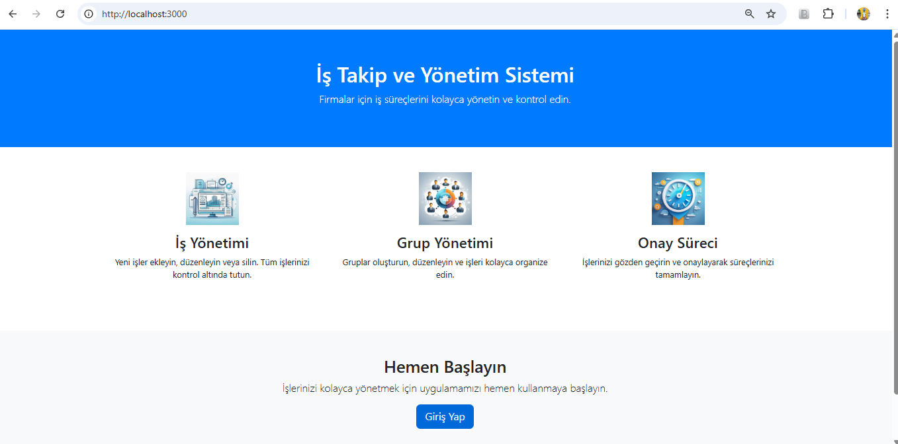
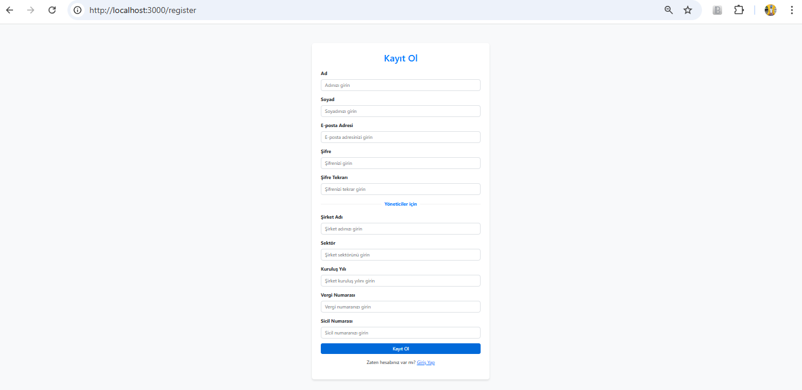
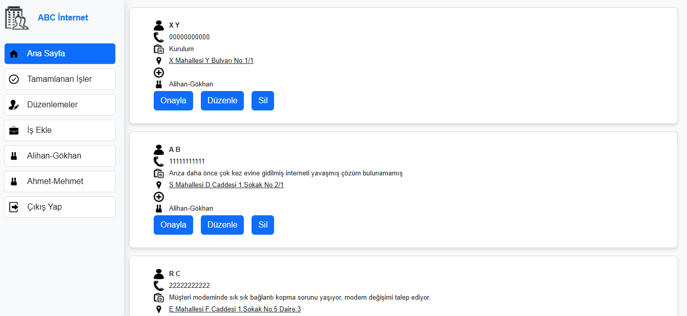
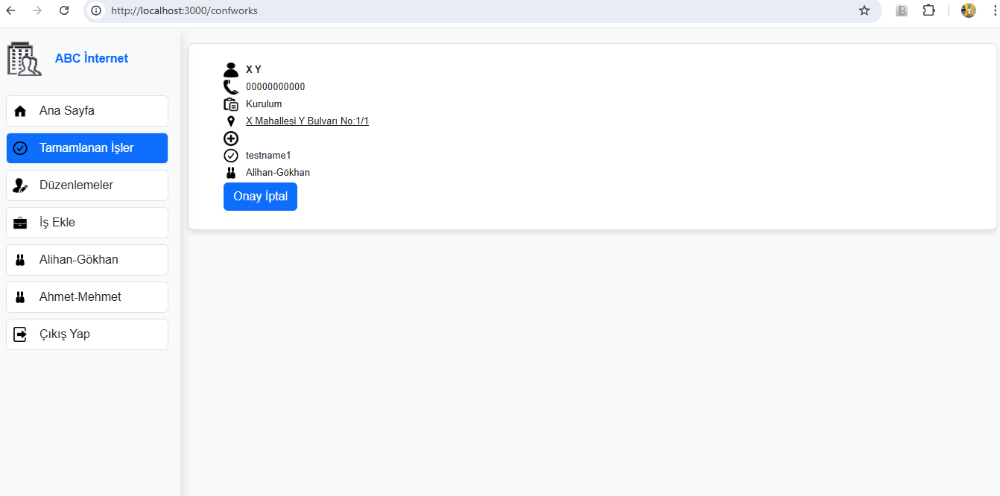
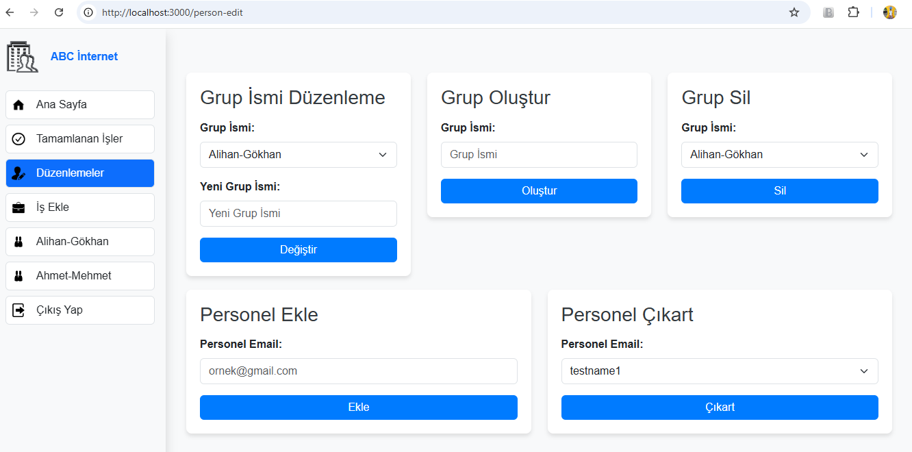
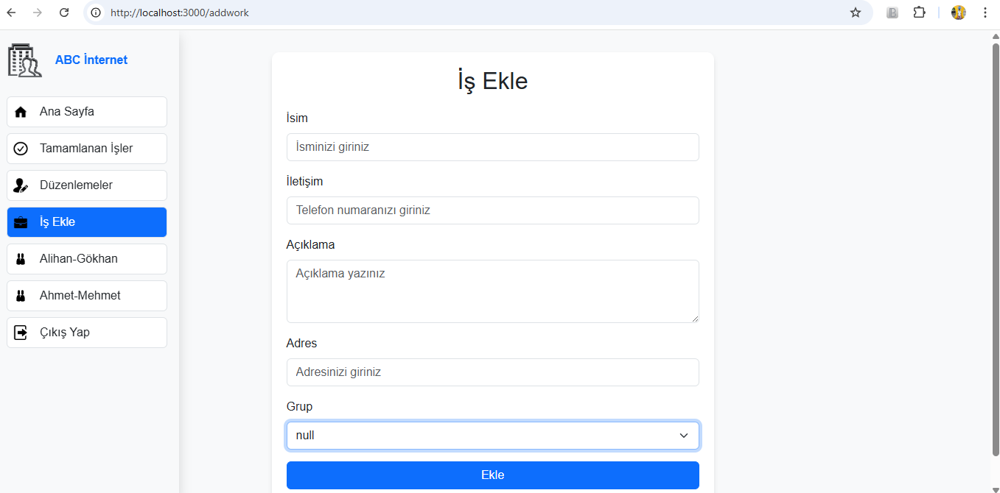
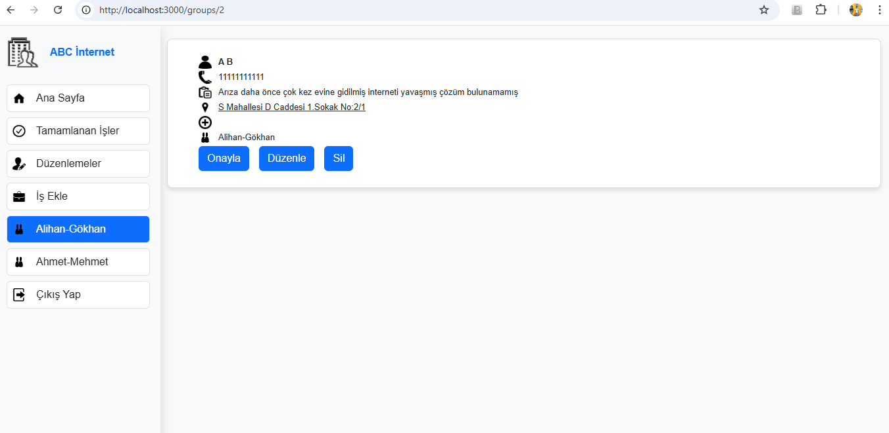
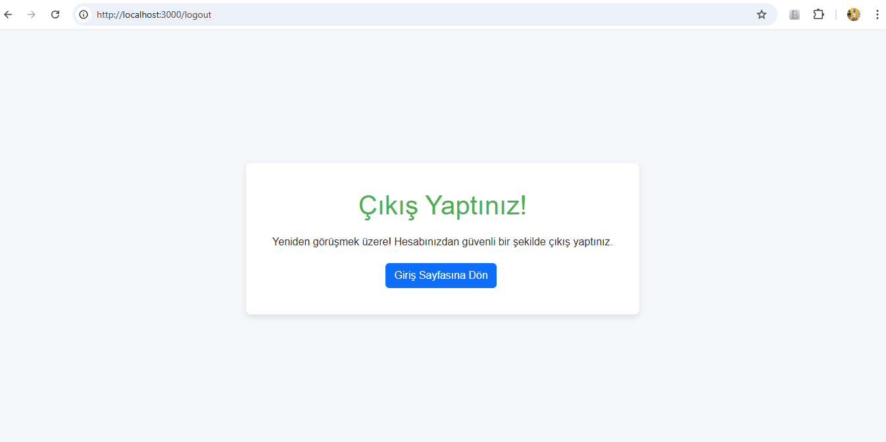

# 📝 To-Do List Web App (Node.js)

Bu proje, **Node.js** ve **Express.js** kullanılarak geliştirilmiş, kullanıcıların kayıt olup kendi kişisel görev listelerini yönetebilecekleri web tabanlı bir "Yapılacaklar Listesi" uygulamasıdır.

## 📋 Proje Hakkında

Basit bir JavaScript listesinden farklı olarak bu proje, **Back-End** mimarisine sahiptir. MVC (Model-View-Controller) yapısı kullanılarak geliştirilmiştir. `Auth` katmanı sayesinde güvenli giriş/çıkış işlemleri sunar ve her kullanıcının verisi veritabanında ayrı ayrı tutulur.

### 🚀 Özellikler

Uygulama temel olarak iki ana kontrolcü (Controller) üzerinden yönetilir:

* **Kimlik Doğrulama (Auth Management) - `auth.js`**
    * 🔒 **Kullanıcı Kaydı:** Yeni kullanıcı oluşturma.
    * 🔑 **Giriş (Login):** Kayıtlı kullanıcıların sisteme güvenli girişi.
    * 🚪 **Çıkış (Logout):** Oturum sonlandırma.

* **Kullanıcı ve Görev Yönetimi - `users.js`**
    * 📋 **Liste Görüntüleme:** Kullanıcıya özel görevlerin listelenmesi.
    * ✅ **Görev Ekleme/Silme:** Listeye yeni madde ekleme ve tamamlananları kaldırma.
    * 👤 **Profil Yönetimi:** Kullanıcı bilgilerinin işlenmesi.

## 🛠️ Teknolojiler

* **Runtime:** Node.js
* **Framework:** Express.js
* **Veritabanı:** MySQL - Sequelize
* **Mimari:** MVC (Model - View - Controller)
* **Template Engine:** EJS (veya HBS/Pug)

**www.alihandursun.com**

